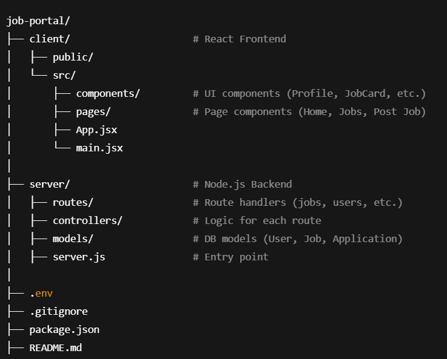

# PrimeHire

## 📸 Project File Structure

---

## 📝 Description

**PrimeHire** is a full-featured job portal system that connects job seekers and job posters on a streamlined, interactive platform. It supports user profiles, job postings, application tracking, and optional MCQ-based assessments for candidates.

---

## 📝 Clone the repository:
git clone https://github.com/AURATORS/PrimeHire.git

---

## 📝 Start the frontend client:
cd client 
npm start

---

## 📝 Start the backend server:
cd server 
nodemon server.js
